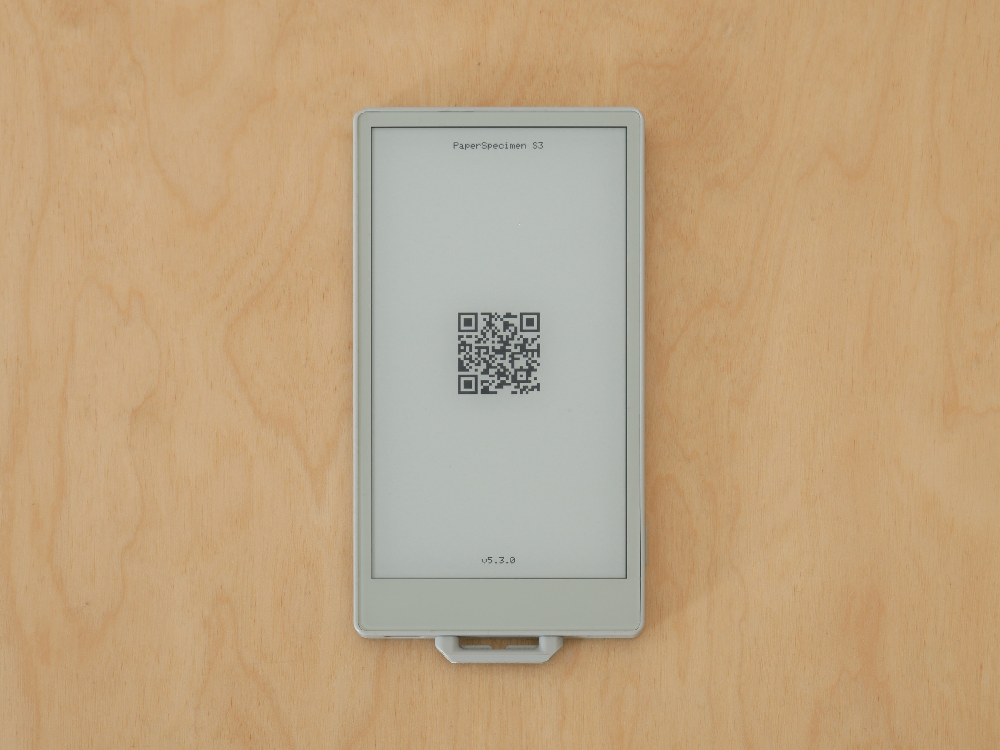
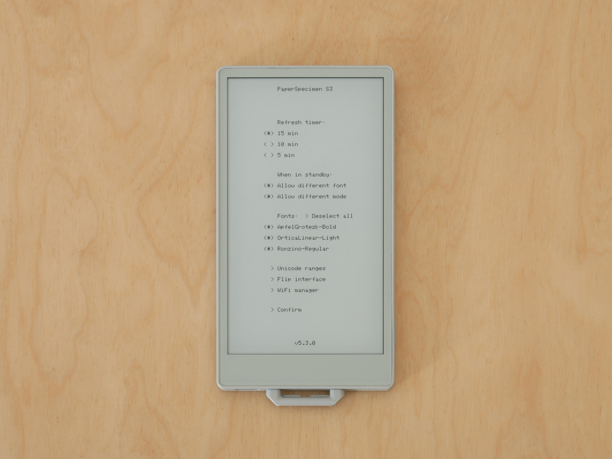
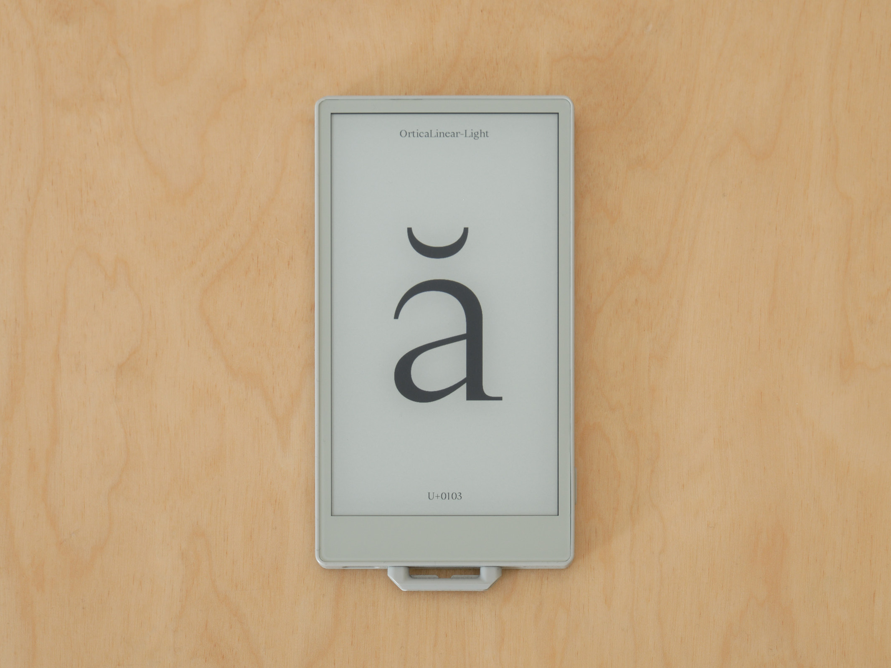
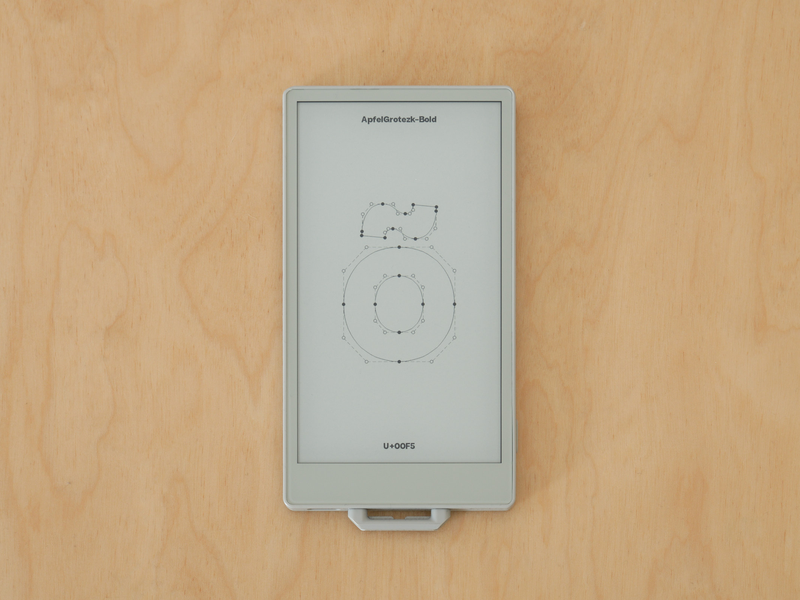

# PaperSpecimen S3

A font specimen viewer for the **M5Paper S3** (ESP32-S3, 4.7" e-ink display). PaperSpecimen S3 loads TrueType (.ttf) and OpenType (.otf/CFF) fonts and displays random glyphs in both bitmap and Bézier outline modes, cycling automatically on a configurable timer. The device works out of the box with 3 built-in fonts — no SD card required. Fonts are automatically cached to internal flash storage (~12 MB) for SD-free operation. Additional fonts can be loaded via SD card or uploaded wirelessly through the built-in WiFi font manager. Designed for ultra-low power consumption — the device sleeps between refreshes and can last up to 2 months on a single charge.

The M5Paper S3 has built-in magnets, making it a smart fridge magnet that automatically refreshes with new typographic specimens throughout the day.


## Hardware

- **M5Paper S3** (M5Stack)
  - ESP32-S3 dual-core @ 80 MHz (downclocked for power savings)
  - 8 MB PSRAM, 16 MB Flash
  - 4.7" e-ink display, 540×960 pixels (portrait), 16 levels of grayscale
  - GT911 capacitive touch
  - BM8563 RTC (maintains time during power-off)
  - AXP2101 PMIC with LiPo battery management
  - MicroSD card slot
  - 1 physical button (power/reset)
  - USB-C for charging and serial debug
  - Built-in magnets (can be mounted on fridges, whiteboards, etc.)

## Features

- **Dual rendering modes**: bitmap (anti-aliased grayscale) and Bézier outline (control points, curves, tangent lines)
- **Automatic cycling**: configurable timer (5–15 minutes) with RTC-based wake from deep power-off
- **Touch interaction**: tap to change glyphs, switch fonts, toggle rendering mode
- **Setup UI**: on-device configuration with touch-based menu
- **3 built-in fonts**: works immediately without an SD card (Apfel Grotezk Bold, Ortica Linear Light, Ronzino Regular — all OFL licensed)
- **Font management**: supports up to 100 TrueType/OpenType fonts, enable/disable individually
- **Unicode range selection**: 28 configurable ranges (Basic Latin through Latin Extended Additional)
- **WiFi manager**: upload, rename, and delete fonts wirelessly from any browser — plus OTA firmware updates via WiFi
- **Flip interface**: rotate display 180° for lanyard/inverted mounting
- **Debug mode**: serial logging, battery drain tracking, faster timer options
- **Battery monitoring**: automatic shutdown at 5% with low-battery icon
- **Power optimized**: WiFi/BT disabled, display controller sleep, SD closed early, ~0.06%/hour drain at 15-min timer

## Setup

### Prerequisites

- [PlatformIO](https://platformio.org/) (VSCode extension or CLI)
- M5Paper S3 (MicroSD card optional — device includes 3 built-in fonts)
- Additional TrueType/OpenType font files (.ttf or .otf) if desired

### SD Card Structure

```
/
├── fonts/
│   ├── MyFont-Regular.ttf
│   ├── AnotherFont-Bold.ttf
│   └── ...
└── paperspecimen.cfg    (created automatically after first setup)
```

Place your `.ttf` or `.otf` font files in a `/fonts` directory on the SD card root. On first setup, the device copies all fonts to internal flash storage (~12 MB available). If the total font size fits within this limit, the SD card is no longer needed and can be removed — the device operates entirely from flash, saving power. If fonts exceed 12 MB, the device falls back to reading from SD.

If no SD card is inserted, the device uses 3 built-in fonts that are automatically extracted to flash on first boot. You can later add more fonts wirelessly via the WiFi font manager.

### Option A: Flash Pre-built Binary

A pre-built binary is available on the [Releases page](https://github.com/marcelloemme/PaperSpecimenS3/releases/latest). Download the `.bin` file from the latest release.

```bash
# Install esptool if not already available
pip install esptool

# Flash the binary (replace /dev/ttyUSB0 with your serial port)
esptool.py --chip esp32s3 --port /dev/ttyUSB0 --baud 460800 \
  write_flash 0x10000 PaperSpecimenS3_vX.X.X.bin
```

On macOS the port is typically `/dev/cu.usbmodem*`. On Windows it is `COM3` or similar.

### Option B: Build from Source

```bash
# Clone the repository
git clone https://github.com/marcelloemme/PaperSpecimenS3.git
cd PaperSpecimenS3

# Build
pio run

# Upload to device
pio run -t upload

# Monitor serial output (debug mode only)
pio device monitor
```

## First Boot



1. **Splash screen** appears for 5 seconds showing a QR code linking to this repository
2. The **setup screen** is displayed with configuration options
3. Configure your preferences (see Configuration below)
4. Tap **Confirm** to start

### Activating Debug Mode

During the 5-second splash screen, tap the screen **4 or more times** to activate debug mode. Debug mode enables:

- Serial output over USB-C (115200 baud)
- Battery drain log written to `/battery_log.txt` on SD (only if SD was present at setup)
- Additional timer options: 1 min, 2 min, 5 min (useful for testing)

In normal mode, serial output and battery log are disabled to save power. In debug mode without an SD card, the battery percentage is shown on screen next to the codepoint but no log file is written — this provides a more accurate battery drain measurement for SD-free operation.

## Configuration



The setup screen provides the following options:

### Refresh Timer
How often the device wakes to display a new glyph:
- **Normal mode**: 5 min, 10 min, 15 min
- **Debug mode**: 1 min, 2 min, 5 min

### When in Standby
- **Allow different font**: when enabled, each automatic wake selects a random enabled font. When disabled, the device keeps showing the same font.
- **Allow different mode**: when enabled, each automatic wake randomly switches between bitmap and outline rendering. When disabled, it maintains the last active mode.

### Fonts
Enable or disable individual fonts. Only enabled fonts are used for automatic cycling and manual browsing.

- With ≤20 fonts: shown inline in the setup screen with pagination, Select All / Deselect All
- With >20 fonts: opens a dedicated sub-screen (tap `> Fonts`) with pagination, Select All / Deselect All

### Unicode Ranges
Tap `> Unicode ranges` to configure which Unicode ranges are used for random glyph selection. 28 ranges are available across 2 pages:

| Range | Description |
|-------|-------------|
| Basic Latin | A-Z, a-z, 0-9, punctuation |
| Latin-1 Supplement | Accented characters (à, é, ñ, ü, etc.) |
| Latin Extended-A | Central/Eastern European characters |
| Latin Extended-B | African, Croatian, Romanian additions |
| IPA Extensions | Phonetic alphabet symbols |
| Spacing Modifier Letters | Modifier characters |
| Combining Diacritical | Accent combining marks |
| Greek and Coptic | Greek alphabet |
| Cyrillic | Russian, Ukrainian, etc. |
| Armenian | Armenian alphabet |
| Hebrew | Hebrew alphabet |
| Arabic | Arabic alphabet |
| Thai | Thai alphabet |
| Georgian | Georgian alphabet |
| Hangul Jamo | Korean components |
| General Punctuation | Dashes, quotes, special punctuation |
| Superscripts/Subscripts | ¹²³ etc. |
| Currency Symbols | €£¥ etc. |
| Letterlike Symbols | ℃, ℮, ™ etc. |
| Number Forms | Roman numerals, fractions |
| Arrows | ← → ↑ ↓ etc. |
| Math Operators | ±×÷∑∫ etc. |
| Misc Technical | ⌘⌥⎋ etc. |
| Box Drawing | ┌─┐│ etc. |
| Block Elements | ▀▄█ etc. |
| Geometric Shapes | ●■▲ etc. |
| Misc Symbols | ☀★♠♣ etc. |
| Latin Extended Additional | Vietnamese, Welsh additions |

The first 6 ranges (Basic Latin through IPA Extensions) are enabled by default.

### Flip Interface
Tap `> Flip interface` to rotate the entire UI 180°. Useful when wearing the M5Paper S3 on a lanyard (the device hangs upside down). The flip state is saved and persisted across reboots.

### WiFi Manager
Tap `> WiFi manager` to launch a wireless manager. The device creates a WiFi access point and serves a web-based interface for managing fonts and updating firmware without removing the SD card:

- **SSID**: `PaperSpecimenS3`
- **Password**: `seriforsans`
- **URL**: `paperspecimen.local` or `192.168.4.1`

From any phone or computer connected to the WiFi, open a browser to access the font manager. You can:
- **Upload** new .ttf/.otf font files directly to the device
- **Rename** existing fonts
- **Delete** fonts you no longer need

All changes are staged as a preview — nothing is written until you tap "Apply changes". After applying, the device restarts automatically with the updated font library.

When no SD card is present, the WiFi manager operates directly on the internal flash storage, with a real-time display of available space. Uploads that would exceed the flash capacity are blocked.

The WiFi session has a 5-minute timeout. If no action is taken, the device exits WiFi mode and restarts. The CPU is temporarily boosted to 160 MHz while WiFi is active, then returns to 80 MHz on exit.

#### OTA Firmware Update

The WiFi manager also includes a firmware update section at the bottom of the page. To check for updates:

1. Tap **Scan for networks** to see available WiFi networks
2. Select your home network and enter the password
3. The device connects to your router (while keeping the captive portal active) and checks GitHub Releases for a newer version
4. If an update is available, tap **Download and install** — progress is shown both on the web page and on the e-ink display
5. The device restarts automatically after a successful update

### Confirm
Tap `> Confirm` to save the configuration and start displaying glyphs. The setup auto-confirms after 60 seconds of inactivity.

## Touch Zones (Active Mode)

When viewing glyphs, the screen is divided into touch zones:

```
┌───────────────────────┐
│      TOP (y < 90)     │  Toggle bitmap ↔ outline
│        540 × 90       │  (keeps current glyph + font)
├───────┬──────┬────────┤
│       │      │        │
│  LEFT │CENTER│ RIGHT  │
│  180× │ 180× │ 180×   │
│  780  │ 780  │ 780    │
│       │      │        │
│  Prev │Random│ Next   │
│  font │glyph │ font   │
│       │      │        │
│       │ HOLD │        │
│       │ 5s → │        │
│       │setup │        │
│       │      │        │
├───────┴──────┴────────┤
│    BOTTOM (y ≥ 870)   │  Toggle bitmap ↔ outline
│       540 × 90        │  (keeps current glyph + font)
└───────────────────────┘
```

- **Top / Bottom strips**: toggle between bitmap and outline rendering mode
- **Left column**: previous enabled font (same glyph, same mode)
- **Center column**: random glyph (same font, same mode)
- **Right column**: next enabled font (same glyph, same mode)
- **Center hold 5s**: restart and return to setup screen (progress circle appears after 1s)

After **40 seconds** of inactivity, the device enters sleep and begins the automatic timer cycle.

## Rendering Modes

### Bitmap Mode



Renders the glyph as a filled shape using FreeType's rasterizer with full 16-level grayscale anti-aliasing. The glyph is displayed at the maximum size that fits nicely the screen (420px on the longest side). Horizontal centering uses a hybrid approach that blends between bounding-box centering (for wide glyphs) and advance-width centering (for narrow glyphs), producing more optically balanced results — especially for accented characters and punctuation.

### Outline Mode



Renders the glyph's Bézier curves showing the underlying vector structure:
- **Filled circles**: on-curve control points
- **Hollow circles**: off-curve control points (quadratic Bézier handles)
- **Solid lines**: straight segments and Bézier curves (approximated), anti-aliased with Xiaolin Wu algorithm for smooth edges
- **Dashed lines**: tangent/control lines connecting off-curve points, also anti-aliased

Supports up to 600 outline points and segments per glyph.

## Display Information

Each glyph screen shows:
- **Top label**: font name (truncated with "..." if too long)
- **Bottom label**: Unicode codepoint (e.g., `U+0041`)
- **Bottom label (debug mode)**: Unicode codepoint + battery percentage (e.g., `U+0041 - 87%`)

## Sleep / Wake Behavior

### Automatic Wake (Timer)
The device uses the BM8563 RTC alarm to wake at precise intervals. Each wake cycle:
1. Powers on (~3 seconds boot)
2. Loads configuration from flash (or SD if fonts exceed flash capacity)
3. Detects wake type (timer vs manual, using 4-second tolerance)
4. Selects random font/mode (if allowed by config)
5. Selects random glyph from enabled Unicode ranges
6. Renders glyph with full refresh
7. Calculates next wake time (anchored to prevent drift)
8. Powers off completely

Wake times are **anchored**: each wake is calculated from the previous wake time, not from "now". This prevents cumulative drift over many cycles.

### Manual Wake (Button)
Pressing the physical button wakes the device before the timer expires. The device detects this and enters interactive mode:
- The previous glyph remains on screen (no blank flash)
- Touch input is enabled for manual browsing
- After 40 seconds of inactivity, returns to sleep

### Returning to Setup
- **Long press** (5+ seconds) on the center of the screen triggers a full restart, including the splash screen and setup
- If previously in debug mode with a short timer (1 or 2 min), the timer resets to 15 min for normal use

## Battery

- **Monitoring**: battery voltage is read on each wake via AXP2101 ADC
- **Low battery**: at 5% the device displays a battery icon and shuts down completely, disabling the RTC alarm
- **Charging**: USB-C charges the LiPo regardless of device state (even with serial disabled)

### Estimated Battery Life

| Timer | Wakes/hour | Battery drain | Estimated life |
|-------|-----------|---------------|----------------|
| 1 min (debug) | 60 | ~0.66%/hour | ~6 days |
| 5 min | 12 | ~0.15%/hour | ~1 month |
| 10 min | 6 | ~0.09%/hour | ~6 weeks |
| 15 min | 4 | ~0.06%/hour | ~2 months |

*Estimates based on measured drain of 0.66%/hour in debug mode (1-min timer) with 5 fonts loaded.*

## Configuration File

Settings are stored in `/.paperspecimen.cfg` (hidden file) on internal flash or SD card as plain text:

```
15                  ← wake interval (minutes)
1                   ← allow different font (1=yes, 0=no)
1                   ← allow different mode (1=yes, 0=no)
0                   ← debug mode (1=yes, 0=no)
0                   ← flip interface (1=yes, 0=no)
1                   ← font 0 enabled
1                   ← font 1 enabled
0                   ← font 2 disabled
...
---                 ← separator
1                   ← range 0 (Basic Latin) enabled
1                   ← range 1 (Latin-1 Supplement) enabled
0                   ← range 2 (Latin Extended-A) disabled
...
```

## Power Optimizations

- CPU downclocked to 80 MHz
- WiFi and Bluetooth disabled at boot
- Serial disabled in normal mode (no USB CDC overhead)
- Touch controller disabled during timer wake
- E-ink display controller put to sleep 3 seconds after last full refresh
- 3 built-in fonts (no SD card required for basic operation)
- Fonts cached to internal flash (~12 MB) — SD card not needed after initial setup
- SD card bus fully powered off when fonts are in flash
- FreeType stream-based font loading (reads directly from flash/SD, no full-file RAM allocation)
- Touch polling at 50 Hz (20ms interval)
- `pushGrayscaleImage` for efficient bitmap transfers (vs pixel-by-pixel)
- SPI transaction batching for outline rendering (`startWrite`/`endWrite`)
- Single-pass label rendering using font-global metrics (no redundant rasterization)
- Blank glyph detection via `FT_LOAD_NO_SCALE` (avoids unnecessary rendering)

## Refresh Management

The e-ink display uses a mix of full and partial refreshes to balance image quality and ghosting:

- **First render**: always full refresh (clean black/white cycling)
- **Subsequent renders**: partial refresh (faster, no flashing)
- **Every 5 partial refreshes**: forced full refresh (anti-ghosting)
- **After 10 seconds without input**: automatic full refresh if any partial was done
- **Minimum 10 seconds between full refreshes**: prevents excessive wear

## Acknowledgments

- Built with [M5Unified](https://github.com/m5stack/M5Unified) and [M5GFX](https://github.com/m5stack/M5GFX)
- Font rendering by [FreeType](https://freetype.org/) (with CFF/PostScript support via custom module integration)
- Original [PaperSpecimen](https://github.com/marcelloemme/PaperSpecimen) for M5Paper (1st generation)
- Built-in fonts from [Collletttivo](https://www.collletttivo.it/) (OFL licensed):
  - **Apfel Grotezk** by Luigi Gorlero
  - **Ortica Linear** by Elisa Benedetti
  - **Ronzino** by Chialab

## License

This project is open source. See the original [PaperSpecimen](https://github.com/marcelloemme/PaperSpecimen) repository for license details.